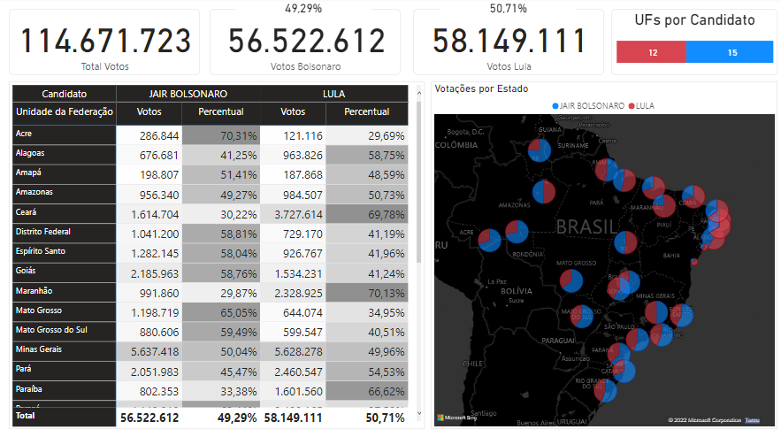

# Power BI - Eleições Brasileiras - 2º Turno

## Sobre

Este é um arquivo em Power BI que realiza o consumo dos arquivos JSONs do TSE (https://resultados.tse.jus.br/) utilizando linguagem M através de função personalizada para realizar as requisições e posteriormente condensar todos os dados, tornando possível realizar diversas análises com os dados retornados.

## Visão

    

